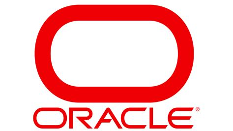

### About Me

👋  Thanks for stopping by, I am a developer with 7+ years professional experience.  When I'm not writing code, I am writing music, engaged in continuous learning, or meditating in nature.

#### Actively seeking new opportunities 

* <strong>Practical:</strong> <i>To build an app that will scale, is reusable, maintainable, and avoids magic that no developer can discern, this is what it means to succeed in the world of software development, Wait did anyone get the user requirements? NOOOOOO!</i>
* <strong>Collaborative:</strong> <i>An opportunity to inspire and be inspired while building exciting projects with cool & creative people</i>
* <strong>Ego?</strong> <i>Wim Hof put it best: "No Ego, We Go."</i>
* <strong>Currently Learning More About: </strong>
  <ul>     
      <li><i>Python & Django</i></li>
      <li><i>Node.js & Express</i></li>
      <li><i>supaBase, Mongo DB</i></li>
      <li><i>AI Prompt Enigneering</i></li>
      <li><i>Mozart, Korean Cooking</i></li> 
  </ul>

### Languages and Tools

    <strong>Front End:</strong> 
  
  HTML5 &nbsp;&nbsp;

  
  CSS3 &nbsp;&nbsp;

  
  Javascript &nbsp;&nbsp;

   
  React &nbsp;&nbsp;
  
  
  Hooks &nbsp;&nbsp;

 

<strong>Tooling:</strong>
  
  Babel &nbsp;&nbsp;

  
  Git &nbsp;&nbsp;
  
  
  Webpack &nbsp;&nbsp;

  
  NPM &nbsp;&nbsp;

 

  <strong> Database:</strong>
  
  MySQL &nbsp;&nbsp;
   
  
  PL/SQL &nbsp;&nbsp;

<!--
dschreiter/dschreiter is a ✨ special ✨ repository because its `README.md` (this file) appears on your GitHub profile.
You can click the Preview link to take a look at your changes.

- 👋 Hi, I’m @dschreiter
- 👀 I’m interested in ...
- 🌱 I’m currently learning ...
- 💞️ I’m looking to collaborate on ...
- 📫 How to reach me ...

-->
